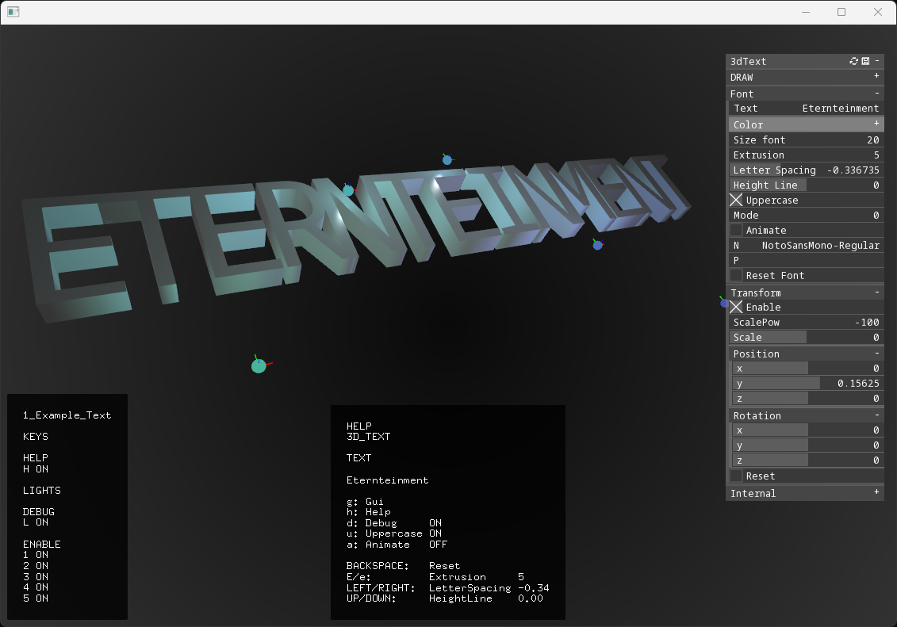
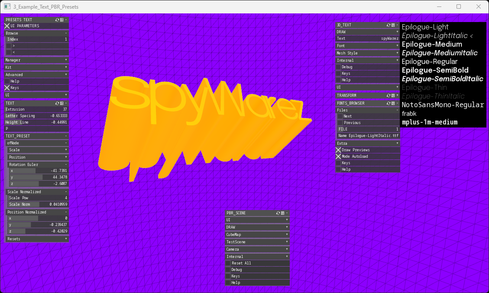

#  WIP

Converts `ofTrueTypeFonts` to a 3D `ofMesh` with a paired `ofNode`.
Allows set extrusion size, font spacing, and other customizations.

 

## 1_Example_Text

## 2_Example_Text_PBR

## 3_Example_Text_PBR_Presets

## 4_Example_Text_ImGui

### Requeriments:
https://github.com/moebiussurfing/ofxSurfingHelpersLite  
https://github.com/moebiussurfing/ofxSurfingPBR/  
https://github.com/moebiussurfing/ofxSurfingPresetsLite  
https://github.com/moebiussurfing/ofxSurfingImGui  
https://github.com/moebiussurfing/ofxImGuizmo  

#### Check each example `addons.make`
Each example requires his own dependencies/addons.
